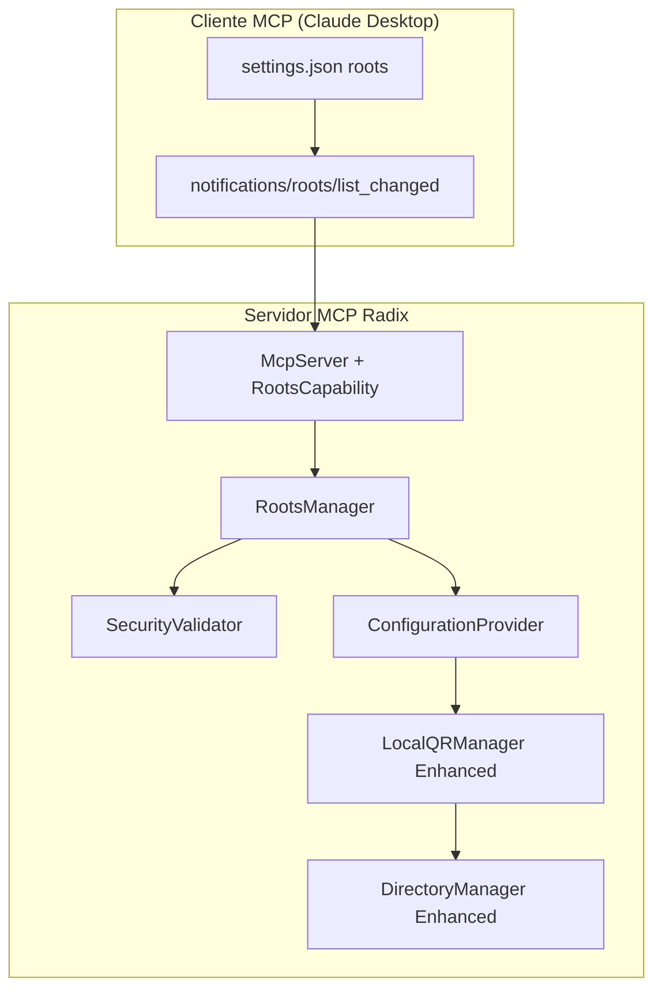

# 🏗️ Diseño Arquitectural: Configuración de Directorios via MCP Roots

**Fecha**: 2025-01-23  
**Agente**: architecture-designer  
**Funcionalidad**: Implementación Completa MCP Roots  
**Basado en**: `analysis/requirements-mcp-roots.md`

## 🎯 Resumen Arquitectural

### Objetivo del Diseño
Diseñar una arquitectura extensible que implemente el protocolo MCP roots mientras mantiene compatibilidad total con la arquitectura existente, siguiendo principios SOLID y patrones de Clean Architecture.

### Principios Guía
- **Single Responsibility**: Cada componente tiene una responsabilidad bien definida
- **Open/Closed**: Extensible para nuevos tipos de configuración, cerrado para modificación
- **Dependency Inversion**: Abstracciones estables, implementaciones flexibles
- **Separation of Concerns**: Protocolo MCP, validación de seguridad, y gestión de archivos separados

---

## 🔍 Análisis de Arquitectura Actual

### Componentes Existentes
```
McpServer (src/index.ts)
├── Capabilities: { tools: {}, prompts: {} }
├── Tools: xrd_transaccion, deeplink_to_qr, deeplink_to_qr_local
└── Prompts: transferir_xrd

LocalQRManager (src/helpers/local-qr-manager.ts)  
├── DirectoryManager: Gestión qrimages/ con validación
├── FilenameGenerator: Nombres únicos con hash
├── LocalQRGenerator: Generación PNG física
└── Configuration: HARDCODED a qrimages/

DirectoryManager (src/helpers/directory-manager.ts)
├── Directory validation: Permisos, existencia, limpieza
├── Security: Path validation básica
└── Statistics: File counts, sizes, cleanup
```

### Gaps Arquitecturales Identificados
1. **Sin capability `roots`** en McpServer
2. **Configuración estática** en LocalQRManager
3. **Validación de seguridad** insuficiente para directorios externos
4. **Sin handler** para `notifications/roots/list_changed`

---

## 🏗️ Arquitectura Propuesta

### Vista General del Sistema


### Componentes Nuevos

#### 1. **RootsManager** (Orquestador Principal)
```typescript
interface IRootsManager {
  handleRootsChanged(roots: string[]): Promise<RootsChangeResult>
  getCurrentRoots(): string[]
  validateRoots(roots: string[]): Promise<RootsValidationResult>
  getSecurityPolicy(): SecurityPolicy
}
```

**Responsabilidades**:
- Recibir notifications del protocolo MCP
- Orquestar validación de seguridad
- Actualizar configuración LocalQRManager
- Logging y auditoría de cambios

#### 2. **SecurityValidator** (Validación Robusta)
```typescript
interface ISecurityValidator {
  validateDirectoryPath(path: string): Promise<SecurityValidationResult>
  isPathAllowed(path: string): boolean
  sanitizePath(path: string): string
  checkWritePermissions(path: string): Promise<boolean>
}
```

**Responsabilidades**:
- Prevenir path traversal attacks
- Validar whitelist de directorios
- Normalización de paths multiplataforma
- Rate limiting de cambios

#### 3. **ConfigurationProvider** (Gestión de Configuración)
```typescript
interface IConfigurationProvider {
  getQRDirectory(): string
  updateQRDirectory(path: string): Promise<void>
  getConfigurationSource(): ConfigSource
  resetToDefault(): void
}
```

**Responsabilidades**:
- Resolver precedencia de configuración (roots > env > default)
- Cambio dinámico sin reinicio
- Fallback graceful a configuración anterior

---

## 🔧 Componentes Refactorizados

### LocalQRManager Enhanced
```typescript
class LocalQRManager {
  private configurationProvider: IConfigurationProvider;
  
  constructor(
    config: LocalQRManagerConfig,
    configurationProvider: IConfigurationProvider
  ) {
    // Dependency injection del ConfigurationProvider
  }
  
  async generateQRLocal(deeplink: string): Promise<QRLocalGenerationResult> {
    // Usar directorio dinámico desde configurationProvider
    const currentDir = this.configurationProvider.getQRDirectory();
    // ... resto del flujo actual
  }
}
```

### DirectoryManager Enhanced  
```typescript
class DirectoryManager {
  async validateDirectoryForRoots(path: string): Promise<RootsDirectoryValidation> {
    // Validaciones específicas para directorios roots
    // Más restrictivas que las validaciones actuales
  }
  
  async ensureDirectoryWithSecurityCheck(path: string): Promise<DirectoryInfo> {
    // Verificaciones adicionales de seguridad
    // Logging de auditoría para cambios de directorio
  }
}
```

---

## 🔌 Integración con Arquitectura Existente

### 1. Modificación McpServer (src/index.ts)
```typescript
// Actualización de capabilities
const server = new McpServer({
  name: "simple-mcp-server",
  version: "1.0.0",
}, {
  capabilities: {
    tools: {},
    prompts: {},
    roots: {           // ← NUEVA CAPABILITY
      listChanged: true
    },
  },
});

// Nuevo handler para roots
server.notification("notifications/roots/list_changed", async (notification) => {
  await rootsManager.handleRootsChanged(notification.params.roots);
});

// Nuevas herramientas MCP
server.tool("list_allowed_directories", /* ... */);
server.tool("get_qr_directory_info", /* ... */);
server.tool("set_qr_directory", /* ... */);
```

### 2. Inyección de Dependencias
```typescript
// Inicialización con DI
const securityValidator = new SecurityValidator(securityConfig);
const configurationProvider = new ConfigurationProvider(defaultConfig);
const rootsManager = new RootsManager(securityValidator, configurationProvider);

// LocalQRManager actualizado
const localQRManager = new LocalQRManager(config, configurationProvider);

// Integración con servidor
server.setRootsManager(rootsManager);
```

---

## 🔐 Estrategia de Seguridad

### Capas de Validación
```typescript
interface SecurityPolicy {
  allowedBasePaths: string[];      // Directorios base permitidos
  maxDirectoryDepth: number;       // Prevenir paths muy profundos
  prohibitedPatterns: RegExp[];    // Patrones prohibidos (../, etc)
  requireWritePermissions: boolean; // Validar permisos antes de usar
  enableAuditLogging: boolean;     // Log de cambios de directorio
}
```

### Validaciones por Capas
1. **Sintáctica**: Formato de path, caracteres válidos
2. **Semántica**: Path traversal, normalización
3. **Permisos**: Lectura/escritura, existencia
4. **Política**: Whitelist, blacklist, restricciones organizacionales

### Logging de Seguridad
```typescript
interface SecurityAuditLog {
  timestamp: string;
  action: 'directory_change_requested' | 'directory_validated' | 'directory_rejected';
  clientInfo: string;
  requestedPath: string;
  validationResult: SecurityValidationResult;
  riskLevel: 'low' | 'medium' | 'high';
}
```

---

## 📊 Contratos de Datos

### MCP Roots Protocol
```typescript
// Notification recibida del cliente
interface RootsListChangedNotification {
  jsonrpc: "2.0";
  method: "notifications/roots/list_changed";
  params: {
    roots: string[];  // Array de paths absolutos
  };
}

// Respuesta de validación interna
interface RootsValidationResult {
  validRoots: string[];
  invalidRoots: Array<{
    path: string;
    reason: string;
    securityLevel: 'warning' | 'error';
  }>;
  selectedRoot: string | null;  // Path seleccionado para QR
}
```

### Configuración Dinámica
```typescript
interface DynamicConfiguration {
  qrDirectory: string;
  source: 'roots' | 'environment' | 'commandLine' | 'default';
  lastUpdated: string;
  validatedAt: string;
  securityFlags: {
    pathNormalized: boolean;
    permissionsValidated: boolean;
    whitelistChecked: boolean;
  };
}
```

---

## 🔄 Flujos de Interacción

### Flujo Principal: Cliente Configura Directorio
```
1. Cliente MCP → notifications/roots/list_changed
2. McpServer → RootsManager.handleRootsChanged()
3. RootsManager → SecurityValidator.validateRoots()
4. SecurityValidator → Validaciones (path traversal, permisos, whitelist)
5. RootsManager → ConfigurationProvider.updateQRDirectory()
6. ConfigurationProvider → LocalQRManager actualizado dinámicamente
7. Siguiente QR generado → Usa nuevo directorio
```

### Flujo Fallback: Configuración Inválida
```
1. Validación falla → SecurityValidator retorna errores
2. RootsManager → Logging de intento rechazado  
3. ConfigurationProvider → Mantiene configuración anterior
4. LocalQRManager → Continúa con directorio actual
5. Opcional: Notificar cliente sobre rechazo (futuro enhancement)
```

### Flujo Herramientas: Consulta Estado
```
1. Cliente → list_allowed_directories tool
2. McpServer → RootsManager.getCurrentRoots()
3. RootsManager → Respuesta con directorios configurados y estado
4. Cliente recibe información de configuración actual
```

---

## 📋 Decisiones Arquitecturales (ADRs)

### ADR-001: Dependency Injection para ConfigurationProvider
**Decisión**: Inyectar IConfigurationProvider en LocalQRManager  
**Contexto**: Necesidad de cambio dinámico de directorio sin reinicio  
**Consecuencias**: 
- ✅ Flexibilidad para cambios en runtime
- ✅ Facilita testing con mocks
- ⚠️ Complejidad adicional en inicialización

### ADR-002: Validación de Seguridad por Capas
**Decisión**: SecurityValidator con multiple layers of validation  
**Contexto**: Requisitos estrictos de seguridad para directorios externos  
**Consecuencias**:
- ✅ Defensa en profundidad contra vulnerabilidades
- ✅ Configuración granular de políticas
- ⚠️ Posible over-engineering para casos simples

### ADR-003: Compatibilidad Backward Total
**Decisión**: Mantener API pública de LocalQRManager unchanged  
**Contexto**: Evitar breaking changes en funcionalidad existente  
**Consecuencias**:
- ✅ Zero breaking changes
- ✅ Migración transparente
- ⚠️ Interfaz interna más compleja

### ADR-004: Single Root Directory Selection
**Decisión**: Usar primer directorio válido de la lista roots  
**Contexto**: LocalQRManager actual no soporta múltiples directorios  
**Consecuencias**:
- ✅ Implementación simple
- ✅ Compatible con arquitectura actual  
- ⚠️ Limitación para casos de uso avanzados

---

## 🔧 Patrones de Diseño Aplicados

### Factory Pattern: SecurityValidator Creation
```typescript
class SecurityValidatorFactory {
  static create(policy: SecurityPolicy): ISecurityValidator {
    switch (policy.level) {
      case 'strict': return new StrictSecurityValidator(policy);
      case 'permissive': return new PermissiveSecurityValidator(policy);
      default: return new StandardSecurityValidator(policy);
    }
  }
}
```

### Observer Pattern: Configuration Changes
```typescript
interface IConfigurationObserver {
  onConfigurationChanged(newConfig: DynamicConfiguration): void;
}

class ConfigurationProvider implements IConfigurationProvider {
  private observers: IConfigurationObserver[] = [];
  
  notifyObservers(config: DynamicConfiguration) {
    this.observers.forEach(o => o.onConfigurationChanged(config));
  }
}
```

### Strategy Pattern: Path Validation
```typescript
interface IPathValidationStrategy {
  validate(path: string): ValidationResult;
}

class WindowsPathValidationStrategy implements IPathValidationStrategy {
  validate(path: string): ValidationResult {
    // Windows-specific path validation
  }
}

class UnixPathValidationStrategy implements IPathValidationStrategy {
  validate(path: string): ValidationResult {
    // Unix-specific path validation  
  }
}
```

---

## 🚀 Estrategia de Testing

### Niveles de Testing
```
1. Unit Tests
   ├── SecurityValidator: Path validation edge cases
   ├── ConfigurationProvider: Configuration precedence
   ├── RootsManager: Orchestration logic
   └── Enhanced components: New functionality

2. Integration Tests  
   ├── MCP Protocol: notifications/roots/list_changed end-to-end
   ├── Security Integration: Validation + DirectoryManager
   └── Backward Compatibility: Existing functionality unchanged

3. Security Tests
   ├── Path Traversal: ../, ..\ attack vectors
   ├── Permission Validation: Read/write access verification
   └── Whitelist Compliance: Allowed/forbidden directories
```

### Test Doubles Strategy
```typescript
// Mock para testing
class MockConfigurationProvider implements IConfigurationProvider {
  private qrDirectory = 'test-qr-dir';
  
  getQRDirectory(): string { return this.qrDirectory; }
  async updateQRDirectory(path: string): Promise<void> { 
    this.qrDirectory = path; 
  }
}
```

---

## 📊 Performance Considerations

### Métricas de Performance
```typescript
interface PerformanceMetrics {
  rootsChangeHandling: {
    target: '<100ms';
    validation: '<50ms';
    configuration: '<20ms';  
    notification: '<30ms';
  };
  
  securityValidation: {
    pathSanitization: '<5ms';
    permissionCheck: '<50ms';
    whitelistLookup: '<1ms';
  };
  
  qrGeneration: {
    overall: '<300ms';        // Unchanged from current
    directoryResolution: '<10ms';
  };
}
```

### Optimizaciones Implementadas
- **Caching**: Resultados de validación de directorios (TTL: 5min)
- **Lazy Loading**: SecurityValidator carga políticas solo cuando es necesario
- **Async Operations**: Validaciones de permisos no bloquean respuesta MCP
- **Memory Management**: Cleanup automático de configs obsoletas

---

## 🔍 Monitoreo y Observabilidad

### Logging Estructurado
```typescript
interface StructuredLog {
  timestamp: string;
  level: 'debug' | 'info' | 'warning' | 'error';
  component: 'RootsManager' | 'SecurityValidator' | 'ConfigurationProvider';
  action: string;
  metadata: {
    clientId?: string;
    requestedPath?: string;
    validationResult?: SecurityValidationResult;
    performanceMs?: number;
  };
}
```

### Métricas de Negocio
- **Adoption Rate**: % de clientes usando custom directories
- **Security Incidents**: Intentos de path traversal detectados
- **Performance Degradation**: Cambios en tiempo de generación QR
- **Error Rate**: Fallos en validación de directorios

---

## 🎯 Plan de Migración

### Fase 1: Infraestructura Base
1. Crear interfaces y contratos de datos
2. Implementar SecurityValidator con validaciones básicas
3. Refactorizar LocalQRManager para inyección de dependencias
4. Testing unitario de componentes nuevos

### Fase 2: Protocolo MCP  
1. Actualizar capabilities en McpServer
2. Implementar handler notifications/roots/list_changed
3. Integrar RootsManager con SecurityValidator
4. Testing integration con protocolo MCP

### Fase 3: Herramientas y Polish
1. Implementar tools de gestión (list_directories, etc)
2. Configuración flexible (env vars, command line)
3. Logging y observabilidad completa
4. Testing de seguridad exhaustivo

### Fase 4: Production Readiness
1. Performance tuning y optimizaciones
2. Documentation y ejemplos de configuración
3. Monitoring y alertas
4. Deployment y rollback procedures

---

## ✅ Criterios de Éxito Arquitectural

### Calidad del Código
- [ ] SOLID principles aplicados consistentemente
- [ ] Test coverage >90% para componentes nuevos
- [ ] Zero breaking changes en API pública
- [ ] Performance targets alcanzados

### Seguridad
- [ ] Path traversal attacks prevenidos
- [ ] Validación robusta de permisos
- [ ] Whitelist configurable funcionando
- [ ] Audit logging implementado

### Funcionalidad
- [ ] Protocolo MCP roots implementado correctamente
- [ ] Configuración dinámica sin reinicio
- [ ] Fallback graceful a configuración por defecto
- [ ] Herramientas MCP funcionando

### Operación
- [ ] Logging estructurado implementado
- [ ] Métricas de performance monitoreadas
- [ ] Documentación completa disponible
- [ ] Plan de rollback verificado

---

**Resultado del Diseño**: ✅ **ARQUITECTURA VALIDADA Y LISTA PARA IMPLEMENTACIÓN**

El diseño arquitectural integra de forma elegante el protocolo MCP roots con la arquitectura existente, manteniendo principios de Clean Architecture y asegurando extensibilidad futura sin comprometer la estabilidad actual del sistema.

---

## 📎 Referencias

- **MCP Specification 2025-06-18**: Notifications protocol
- **Radix MCP Server**: Arquitectura actual documentada
- **Security Best Practices**: OWASP Path Traversal Prevention
- **Clean Architecture**: Robert Martin principles
- **Requirements Analysis**: `analysis/requirements-mcp-roots.md`